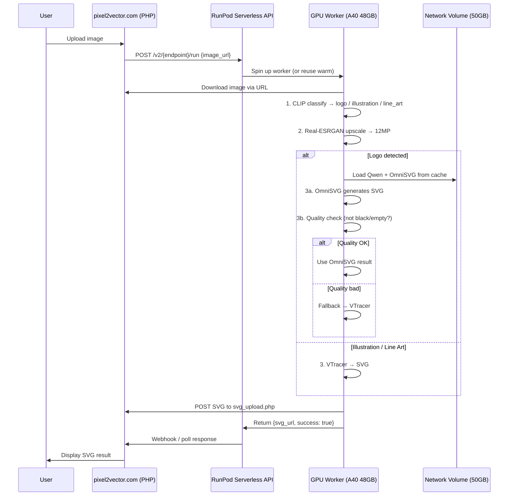

# VectraHub GPU Server — Full Architecture

## Overview

RunPod serverless GPU server that receives images from **pixel2vector.com**, upscales them with **Real-ESRGAN**, vectorizes them (**OmniSVG** for logos, **VTracer** for illustrations), and returns the SVG result.

---

## System Flow



---

## Request / Response Format

### Input (from website → RunPod)
```json
{
  "input": {
    "image": "https://pixel2vector.com/uploads/abc123.png",
    "upscale": 4,
    "color_mode": "color",
    "vtracer_params": {}
  }
}
```

### Output (RunPod → website)
```json
{
  "svg_url": "https://pixel2vector.com/php/api/file_proxy.php?name=vectorized_xxx.svg&dir=outputs&sig=...",
  "svg_size": 45230,
  "success": true
}
```

---

## File Structure

```
gpu-server-48gb/
├── Dockerfile                    # Docker build config
├── handler.py                    # RunPod entry point
├── requirements.txt              # Python dependencies
├── requirements-base.txt         # Base deps (pinned numpy)
├── app/
│   ├── __init__.py
│   ├── config.py                 # Server configuration
│   ├── main.py                   # FastAPI app (unused in serverless)
│   ├── tasks.py                  # Task definitions
│   └── utils/
│       ├── __init__.py
│       ├── image_classifier.py   # CLIP-based logo/illustration detector
│       ├── svg_color_fixer.py    # Post-processing SVG colors
│       ├── cleanup.py            # Temp file cleanup
│       │
│       ├── upscaler/             # Real-ESRGAN module
│       │   ├── __init__.py       # Exports upscale_image()
│       │   ├── upsampler.py      # GPU model loading + inference
│       │   ├── core.py           # Smart upscale (target 12MP)
│       │   └── palette.py        # LAB color palette correction
│       │
│       ├── vtracer/              # VTracer vectorization
│       │   ├── __init__.py       # Exports vectorize_image()
│       │   ├── core.py           # VTracer conversion + presets
│       │   ├── image_type.py     # Image type detection
│       │   ├── background.py     # SVG background removal
│       │   ├── color_verify.py   # Color accuracy verification
│       │   └── gradients.py      # Gradient detection
│       │
│       └── omnisvg/              # OmniSVG deep learning vectorization
│           ├── __init__.py       # Exports vectorize_logo_with_omnisvg()
│           └── core.py           # Model loading, inference, SVG decode
```

---

## Component Details

### 1. `handler.py` — RunPod Entry Point

The main orchestrator. Receives a job from RunPod, processes it through the pipeline, and returns the result.

```
handler(event):
  1. Download image from URL or decode base64
  2. CLIP classify → "logo" | "illustration" | "line_art"
  3. Real-ESRGAN upscale → 12MP (with palette correction)
  4. Route to vectorizer:
     - Logo → OmniSVG (with VTracer fallback)
     - Illustration/Line Art → VTracer
  5. Upload SVG to pixel2vector.com
  6. Return {svg_url, success}
```

**Key flags:**
- `USE_OMNISVG_FOR_LOGOS = True` — enables OmniSVG routing
- Falls back to VTracer if OmniSVG fails or produces bad output

---

### 2. CLIP Classifier (`image_classifier.py`)

Uses `openai/clip-vit-base-patch32` (~600 MB, baked into Docker image).

**Input:** Image path  
**Output:** `"logo"` | `"illustration"` | `"line_art"`

Runs zero-shot classification with prompts like:
- "a company logo or brand icon"
- "an illustration or artwork with gradients"
- "a line art drawing or sketch"

---

### 3. Real-ESRGAN Upscaler (`app/utils/upscaler/`)

Uses `RealESRGAN_x2plus` model (~65 MB, baked into Docker image).

**Pipeline:**
```
Input (any size) → Smart upscale strategy:
  - < 0.5 MP → x2, x2 (two passes)
  - 0.5-3 MP → x2, shrink to 3MP, x2 (final 12MP)
  - > 3 MP → shrink to 3MP, x2 (final 12MP)

After upscaling:
  - LAB palette correction (snap colors to original palette)
  - GPU median blur (edge cleanup, ksize=5)
  - Save to upscaled.png
```

**Returns:** `(success, bg_color, palette, has_gradients)`

---

### 4. VTracer Vectorizer (`app/utils/vtracer/`)

Converts raster images to SVG using pixel tracing. Uses preset parameters based on image type.

**Presets:**
| Type | `color_precision` | `layer_difference` | `max_iterations` |
|------|-------------------|-------------------|-------------------|
| Logo | 8 | 16 | 15 |
| Illustration | 6 | 32 | 10 |
| Line Art | 4 | 48 | 10 |

**Post-processing:**
- Background path removal (XML-based)
- Color verification against original palette
- SVG color fixer for remaining artifacts

---

### 5. OmniSVG (`app/utils/omnisvg/`) — NEW

Deep learning SVG generation for logos. Based on Qwen2.5-VL (vision-language model) fine-tuned for SVG output.

**Architecture:**
```
Image (448×448) → Qwen2.5-VL encoder → Token generation → SVG decoder
                                         ↓
                              SketchDecoder (fine-tuned weights)
                                         ↓
                              SVGTokenizer → Bézier paths → SVG file
```

**Model sizes:**
| Component | Size | Stored In |
|-----------|------|-----------|
| Qwen2.5-VL-7B-Instruct (base) | ~15 GB | Volume (`/runpod-volume`) |
| OmniSVG1.1_8B (weights) | ~17 GB | Volume (`/runpod-volume`) |
| OmniSVG code (repo clone) | ~50 MB | Docker image (`/app/omnisvg_repo`) |

**VRAM usage:** ~17 GB (fits on A40 48GB alongside CLIP + Real-ESRGAN)

**Key code flow in `core.py`:**
```python
def load_omnisvg_model():
    # 1. Override HF_HOME to /runpod-volume (models cached there)
    # 2. Load Qwen2.5-VL tokenizer + processor
    # 3. Initialize SketchDecoder with Qwen base model
    # 4. Load OmniSVG fine-tuned weights
    # 5. Initialize SVGTokenizer for output decoding

def vectorize_logo_with_omnisvg(input_path, output_path):
    # 1. Preprocess: resize to 448×448, white background
    # 2. Prepare chat-style input with system prompt
    # 3. Generate tokens (do_sample=True, temp=0.3)
    # 4. Wrap with BOS/EOS tokens
    # 5. Decode via SVGTokenizer → Bézier paths → SVG
    # 6. Fill missing colors, set viewBox, save
```

---

## Docker Image Layers

```dockerfile
# Base image with PyTorch + CUDA pre-installed
FROM runpod/pytorch:2.2.0-py3.10-cuda12.1.1-devel-ubuntu22.04

# System deps (OpenCV, CairoSVG, git, ffmpeg)
# Python deps (Real-ESRGAN, BasicSR, VTracer, transformers, etc.)
# Pre-download small models (CLIP ~600MB, Real-ESRGAN ~65MB) → baked in image
# Clone OmniSVG repo → /app/omnisvg_repo (code only, ~50MB)
# Copy app code → /app/

# Large models (Qwen ~15GB, OmniSVG ~17GB) → download at runtime to volume
```

**Estimated image size:** ~12-15 GB (without Qwen/OmniSVG weights)

---

## RunPod Network Volume

| Setting | Value |
|---------|-------|
| **Size** | 50 GB |
| **Mount Path** | `/runpod-volume` |
| **Region** | Must match GPU region |
| **Purpose** | Cache Qwen + OmniSVG weights |

**First cold start:** ~5-10 min (downloading 32GB of models)  
**Subsequent cold starts:** ~10-15 sec (loading cached models from volume)  
**Warm worker:** Instant (models already in VRAM)

---

## Environment Variables

| Variable | Value | Purpose |
|----------|-------|---------|
| `HF_HOME` | `/app/models` (build), `/runpod-volume` (runtime) | HuggingFace cache |
| `TORCH_HOME` | `/app/models` | PyTorch model cache |
| `APP_BASE_URL` | `https://pixel2vector.com` | SVG upload destination |
| `SVG_UPLOAD_SECRET` | `(secret)` | Auth for SVG upload API |
| `FILE_PROXY_SECRET` | `(secret)` | Auth for file proxy API |

---

## Quality Gate (OmniSVG → VTracer Fallback)

```python
def quality_check(svg_path):
    """Check if OmniSVG output is usable."""
    svg_content = open(svg_path).read()
    
    # Fail conditions:
    if len(svg_content) < 500:        return False  # Too small (likely empty)
    if '<path' not in svg_content:    return False  # No paths generated
    
    # Render and check if mostly black/white
    # (optional: use CairoSVG to render, check pixel variance)
    
    return True
```

---

## GPU Memory Budget (A40 48GB)

| Component | VRAM | When |
|-----------|------|------|
| CLIP | ~1 GB | Classification (unloaded after) |
| Real-ESRGAN | ~2 GB | Upscaling (unloaded after) |
| OmniSVG (Qwen + weights) | ~17 GB | Logo vectorization |
| **Peak** | **~20 GB** | During OmniSVG inference |
| **Available** | **~28 GB** | Buffer |

---

## Deployment Checklist

1. [ ] Create 50GB Network Volume in same region as GPU
2. [ ] Update Dockerfile with OmniSVG dependencies
3. [ ] Create `app/utils/omnisvg/core.py` with model loading + inference
4. [ ] Update `handler.py` with OmniSVG routing + fallback
5. [ ] Push to GitHub → Docker build via GitHub Actions
6. [ ] Deploy to RunPod Serverless
7. [ ] First run: wait for model download (~5 min)
8. [ ] Test with logo image → verify SVG output
9. [ ] Test with illustration → verify VTracer is used
10. [ ] Test cold start → verify volume cache works
